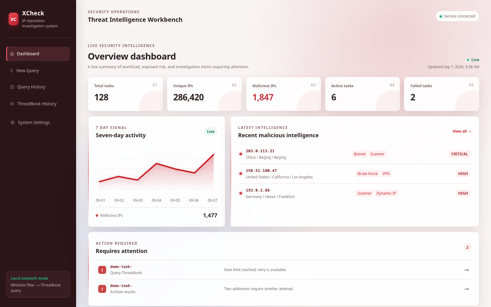

# XCheck IP 信誉排查系统

[English](README.md)

[](LICENSE)

XCheck 是面向可信局域网、自托管部署的 IP 排查工作流。系统支持手动 IP 和常见日志文件，以流式方式解析大体量输入，完成校验、去重和查白，再按照安全速率将剩余公网 IP 提交到微步 IP 信誉接口。

原始输入、任务历史、节点检查点、查白结论、微步批次、故障诊断和情报结果均保存在本地持久化存储中。目前以 200,000 行 CSV 作为验收基线。



> 截图使用纯演示数据及文档专用 IP 地址段，不包含真实任务数据。

## 主要功能

- 三种可切换动态首页：综合驾驶舱、威胁态势、运维工作台
- 默认英文，支持在系统设置中完整切换简体中文
- 六套皮肤、透明悬浮效果、流动光效和四档动效强度
- 支持手动、CSV、XLS、XLSX、ZIP、LOG 和 JSONL 输入
- 流式解析、IP 校验、去重和逐节点进度展示
- 所有微步查询前必须先经过白名单接口
- 当前、历史和失效名单命中后支持一键移除
- 批大小、安全频率、每日额度和重试次数可调整
- 大批量微步历史由服务端筛选和分页
- 首页只读取有界聚合结果，不会向浏览器加载全部明细
- 每个处理阶段均支持按当前语言导出 TXT 和 XLSX
- 失败节点可排查，任务可从检查点继续
- 使用 Docker 部署并监听 `8086` 端口

## 快速启动

运行环境需要 Docker Engine 和 Docker Compose。

```bash
git clone https://github.com/LuckinSven/8086-xcheck-system.git
cd 8086-xcheck-system
cp .env.example .env
docker compose up -d --build
```

访问 `http://<服务器IP>:8086`。容器监听 `0.0.0.0:8086`，服务器防火墙放行该端口后，同一局域网内的设备可以访问。

检查服务状态：

```bash
curl --fail http://127.0.0.1:8086/api/health
```

## 初始配置

启动后打开**系统设置**，在同一页面完成以下配置：

- 界面语言：English 或简体中文
- 皮肤：微步社区红（默认）、情报蓝、护眼青绿、暗夜紫、琥珀沙金、雾海青蓝
- 首页：综合驾驶舱、威胁态势、运维工作台
- 动效：关闭、轻微、中等、强烈
- 白名单和微步接口地址
- 微步 API Key
- 批大小、IP 安全速率、本地每日额度和重试次数

两个接口都支持真实连接测试。测试摘要只保留状态、时间、耗时和安全错误标识。读取设置时不会返回已经保存的微步 API Key，页面也不会显示其明文。

`.env` 只提供首次启动的默认值。通过页面保存的设置会写入本地数据库，并在后续启动时优先使用。

## 查白与微步流程

每个任务都按以下顺序持久化处理：

1. 存档原始输入。
2. 解析并校验 IP 地址。
3. 去重并保留出现次数和位置证据。
4. 调用白名单接口。
5. 排除非公网地址。
6. 如果命中当前、历史或失效名单，由操作员一键移除命中项。
7. 等待操作员启动微步查询。
8. 按受控批次查询微步并归档结果。

如果没有白名单命中，任务会自动进入微步确认步骤。缺失、无效或未知的查白结论绝不会绕过查白关口。微步查询不会自动发起，仍需操作员点击**开始查询微步**。

微步工作台展示持久化进度、耗时、具备有效样本时的预计剩余时间、本任务配置快照、批次证据、安全诊断摘要和分页情报结果。失败或部分完成的任务可以从最近检查点重试。

## 输入格式

上传控件不按照显示的扩展名限制文件；处理节点会验证实际格式，无法解析时会记录可排查错误。

| 日志类型 | 支持文件 | 可识别 IP 字段 |
| --- | --- | --- |
| 攻击日志 | CSV、XLS、XLSX、ZIP、LOG、JSONL | `srcAddress`、`Source Address`、`source_address` |
| 访问日志 | CSV、XLS、XLSX、ZIP、LOG、JSONL | `访问源 IP`、`Source IP`、`source_ip` |

手动输入支持换行、空格、逗号、中文逗号和分号，兼容 IPv4 与 IPv6。单文件默认上限为 500 MB。

## 导出与历史

一次用户提交始终对应一条历史记录，不按照内部批次数拆分。查询历史和微步历史均由服务端筛选、分页。微步历史支持 IP、恶意状态、威胁标签、国家、省、市、严重度、可信度、任务状态和日期筛选。

提取、有效、无效、去重、查白、查白后、非公网、微步待查、已完成、恶意、高可信恶意、非恶意和失败阶段都可以导出 TXT 与 XLSX。导出表头、工作表名、是否公网和处理阶段会跟随当前全局语言；IP、文件名、请求 ID、外部威胁标签、地理信息和证据原值保持不变。

## 数据与备份

`compose.yaml` 将宿主机 `./data` 绑定到容器 `/app/data`。这里保存 SQLite 数据库和上传原文件。常规 `up`、`restart` 和 `down` 不会删除该目录。V1 暂不提供历史删除功能。

升级前应备份整个 `data/`。在线备份 SQLite 时需使用能够保证 WAL 一致性的方案；否则应先停止容器，再复制 `xcheck.db`、`xcheck.db-wal` 和 `xcheck.db-shm`。

## 安全边界

XCheck 按设计不包含登录和角色系统，只应向可信局域网开放 `8086` 端口。任何能够访问服务的用户都可以查看保留的任务数据、修改接口地址以及替换或清除微步凭据。

- 不要提交 `.env` 或 `data/`。
- 已保存的微步 Key 位于本地数据库中，数据库和备份文件都应作为敏感数据保护。
- 使用服务器防火墙将访问来源限制为可信网段。
- 如果需要暴露到互联网，必须在前方增加认证、授权、TLS 和请求防护。
- ZIP 上传限制成员数量和解压后大小，并拒绝路径穿越。
- 首页和结果接口只返回允许的结构化字段，不返回微步原始响应 JSON。

## 常用操作

```bash
docker compose ps
docker compose logs -f --tail=200
docker compose restart
docker compose down
```

备份 `data/` 后更新：

```bash
git pull --ff-only
docker compose up -d --build
curl --fail http://127.0.0.1:8086/api/health
```

更多说明参见 [docs/operations.md](docs/operations.md)。

## 开源协议

项目采用 [Apache License 2.0](LICENSE)，归属和第三方服务说明参见 [NOTICE](NOTICE)。

ThreatBook、微步及相关名称可能是其权利人的商标。本项目是独立的第三方接口集成，与相关服务提供者不存在隶属或背书关系。开源协议不包含第三方 API 的访问权，也不额外授予第三方商标使用权。

## 开发检查

后端：

```bash
python -m venv .venv
.venv/bin/pip install -e '.[dev]'
.venv/bin/ruff check backend tests
PYTHONPATH=backend .venv/bin/pytest -q
```

前端：

```bash
cd frontend
npm ci
npm test -- --run
npm run build
```
